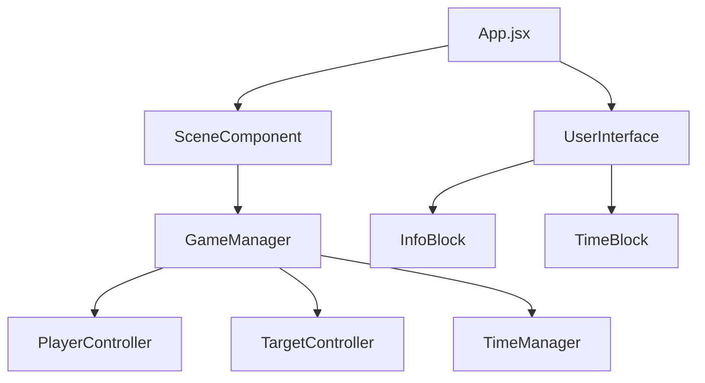
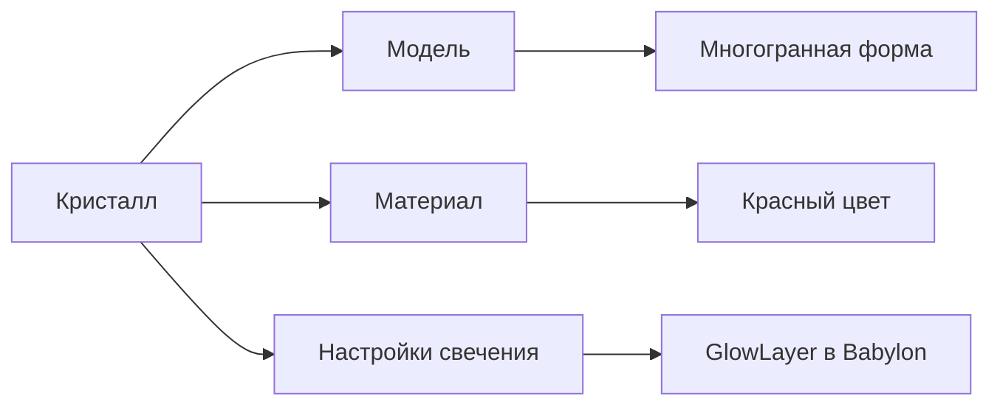
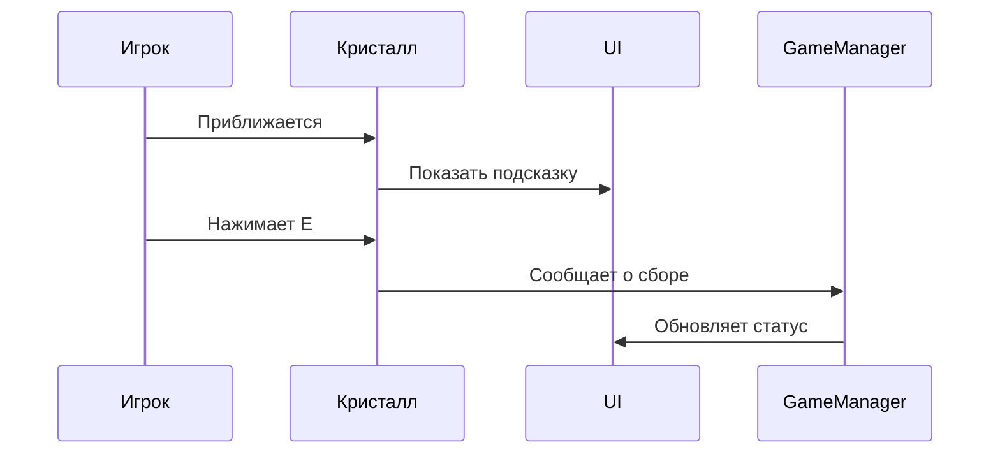

# 👾 Полное техническое руководство по созданию 3D-игры "Spirits & Crystals"

## 💜 1. Введение
**Spirits & Crystals** - это 3D-приключенческая игра с элементами головоломки, где игрок управляет привидением в поисках магических кристаллов в таинственном лесу.

**Технологический стек:**
- 🎮 **Игровой движок**: Babylon.js
- 💻 **Фронтенд**: React + Vite
- 🖌️ **3D-моделирование**: Blender
- 🕹️ **Управление**: WASD + взаимодействие (E)

## 💜 2. Архитектура проекта

### 💠 2.1 Диаграмма компонентов


### 💠 Компонентная структура

| Компонент | Назначение |
|-----------|------------|
| `App.jsx` | Главный компонент, инициализирует сцену и UI |
| `SceneComponent` | Контейнер для 3D-сцены Babylon.js |
| `UserInterface` | Контейнер для элементов UI |
| `GameManager` | Центральный контроллер игровой логики |
| `PlayerController` | Управление движением персонажа |
| `TargetController` | Логика взаимодействия с кристаллами |
| `TimeManager` | Управление игровым временем |

## 💜 Настройка среды разработки

1. Установите Node.js (v16+)
2. Создайте проект Vite:
```bash
npm create vite@latest spirits-and-crystals --template react
cd spirits-and-crystals
npm install @babylonjs/core @babylonjs/hooks
```

3. Установите Blender (версия 3.0+)

## 💜 Создание 3D-моделей в Blender

### 💠 1. Моделирование персонажа (привидения)

# Пример-иллюстрация главного персонажа игры с кристаллом


### 💠 2. Создание кристаллов



### 💠 3. Экспорт моделей

1. Выберите все объекты сцены
2. Файл → Экспорт → Babylon.js (.babylon)
3. Сохраните в папку `src/assets/`

## 💜 Реализация игровой логики

### 💠 Управление персонажем

```javascript
// PlayerController.js
export class PlayerController {
  constructor(scene) {
    this.playerPivot = scene.getMeshByName("PlayerPivot");
    window.addEventListener("keydown", (event) => this.onKeyDown(event.code));
  }

  onKeyDown(eventCode) {
    switch (eventCode) {
      case "KeyA": 
        this.playerPivot.rotate(Axis.Y, -this.rotateOffset, Space.LOCAL);
        break;
      // Остальные управления...
    }
  }
}
```

### 💠 Система сбора кристаллов



```javascript
// TargetController.js
onKeyDown(eventCode) {
  if (eventCode === "KeyE" && this.isPlayerInside) {
    this.crystal.visibility = 0;
    this.wasCrystalTaken = true;
  }
}
```

## 💜 Интерфейс пользователя

### 💠 Структура компонентов UI

```jsx
// UserInterface.jsx
function UserInterface() {
  return (
    <div className="UserInterface">
      <TimeBlock />
      <InfoBlock />
    </div>
  );
}
```

### 💠 Стилизация элементов

```css
/* InfoBlock.css */
.info-block {
  position: absolute;
  bottom: 10vh;
  left: 25vw;
  width: 50vw;
  padding: 2vh;
  background-color: rgba(24, 23, 32, 0.8);
  border-radius: 10px;
  color: white;
}
```

## 💜 Оптимизация производительности

### 💠 Уровни детализации (LOD)

```javascript
// GameManager.js
setupLOD() {
  const highPolyMesh = this.scene.getMeshByName("Crystal1");
  const lowPolyMesh = highPolyMesh.clone("Crystal1_Low");
  lowPolyMesh.simplify([{ distance: 30, quality: 0.5 }]);
  
  highPolyMesh.lodLevels = [
    { distance: 0, mesh: highPolyMesh },
    { distance: 20, mesh: lowPolyMesh }
  ];
}
```

### 💠 Оптимизация теней

| Настройка | Рекомендуемое значение |
|-----------|------------------------|
| Shadow Map Size | 1024x1024 |
| Bias | 0.05 |
| Normal Bias | 0.4 |

## 💜 Заключение

Это руководство охватывает ключевые аспекты создания 3D-игры на React и Blender. Для дальнейшего развития проекта стоит рассмотреть:
1. Добавление кооперативного режима
2. Реализацию звукового сопровождения
3. Создание дополнительных уровней сложности

Пример структуры проекта:
```
/src
  /assets
    GameScene.babylon
  /game-scripts
    GameManager.js
    PlayerController.js
    TargetController.js
  /ui-components
    UserInterface.jsx
    InfoBlock.jsx
    TimeBlock.jsx
  /ui-managers
    InfoManager.js
    TimeManager.js
  App.jsx
  main.jsx
```
